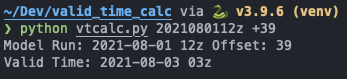
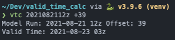

# Valid Time Calculator

Calculates the valid time from a model run time and a given offset value.

    usage: vtcalc.py [-h] model_run offset

    Calculate a valid time from a model run and offset.

    positional arguments:
    model_run   Model Run: (Format: YYYYMMDDHH[z,Z] or in Epoch Seconds
    offset      Number of hours to offset (Format: [+,-]HH) or epoch seconds ([+,-]ssss) (must be greater than 3600)

    optional arguments:
    -h, --help  show this help message and exit

Example Output:  

Tip: for added convienance, add an alias to your profile  
`alias vtc='python <path_to_vtcalc.py> $1 $2'`

